# Spatial Biology Image Analysis Pipeline for Multiplex Microscopy

Python pipeline for spatial tumour analysis combining two complementary imaging modalities. Developed in collaboration with the Confocal Microscopy Unit at CNIO (Spanish National Cancer Research Centre).

**Module 1 — Cyclic Immunofluorescence (cycIF):** full workflow for multiplex fluorescence data acquired on the MACSima™ platform — instance segmentation, per-cell intensity extraction, adaptive marker thresholding, cell phenotyping, population-to-mask signed distances, and inter-population proximity with Voronoi tessellation. Validated on HNSCC biopsies (~80k cells, 22-marker panel).

**Module 2 — H&E Invasion-Front Detection:** deep-learning module that localises tumour-invasion fronts directly on routine Haematoxylin-and-Eosin slides, providing precise tumour–stroma boundaries without extensive manual annotation. Achieves **macro F1 = 0.82** and **AUC > 0.90** on HNSCC tissue.

---

## What the data looks like

Each region of interest (ROI) from an HNSCC biopsy contains up to 22 fluorescence channels. The image below overlays Pan-Cytokeratin (CK, magenta — tumour epithelium), DAPI (blue — nuclei), CD3 (green — T cells), CD4 (red), and FOXP3 (yellow — Tregs).

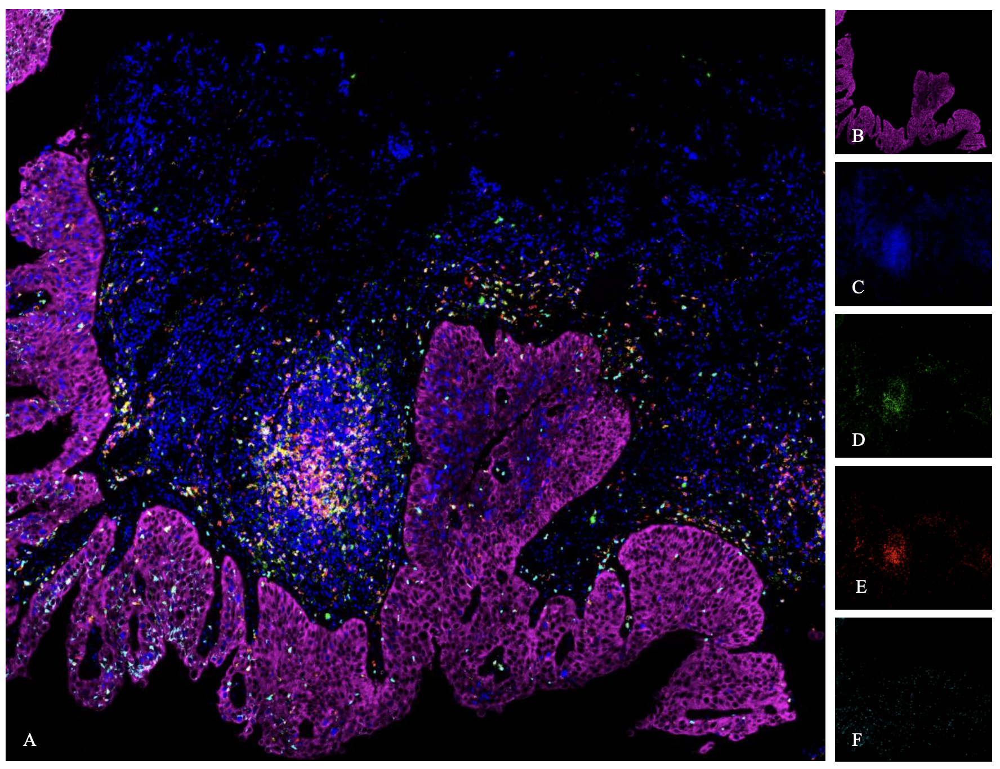

*Panel A: five-channel overlay of a full HNSCC ROI. Panels B–F: individual marker channels.*

---

## Pipeline

```
OME-TIFF (C × H × W)
      │
      ▼
1. Image loading           io/loaders.py                 load_ome_tif_images()
2. Cell segmentation       [external: Cellpose + QuPath]
3. DAPI mask loading       io/loaders.py                 load_dapi_masks()
4. Tissue mask generation  preprocessing/segmentation.py create_channel_masks()
      │
      ▼  labelled masks — each cell gets a unique integer ID
5. Intensity extraction    analysis/intensity.py         process_roi()
6. Binary positivity       analysis/intensity.py         intensity_to_binary()
      │                       T = μ_ROI + k · σ_ROI
      ▼
7. Subpopulation counts    visualization/qc.py           plot_combination_counts()
8. Signed distances        analysis/spatial.py           compute_distances()
9. Voronoi distances       visualization/overlays.py     compute_and_plot_subpop_distances_for_all_rois()
```

### Cell segmentation

Nuclei are segmented by Cellpose and each cell is assigned a unique integer ID. This labelled mask is the spatial anchor for all downstream analysis.

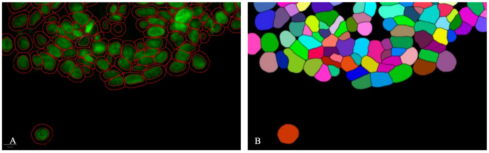

*Left (A): DAPI channel with Cellpose outlines. Right (B): pseudo-coloured instance mask — each cell has a unique colour; background is black.*

### Tumour mask generation

CK intensity is thresholded at the ROI mean (k = 0) to delineate the tumour epithelium. Small debris is removed and holes are filled, giving a binary mask where CK⁺ pixels mark tumour area.

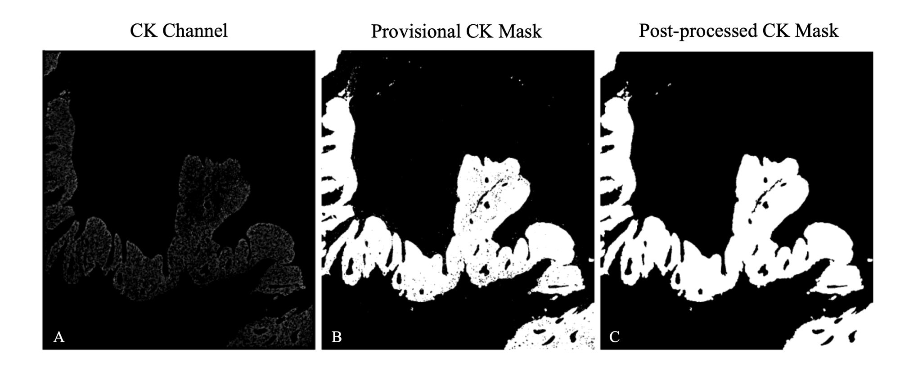

*(A) Raw CK channel. (B) Provisional binary mask. (C) Post-processed mask after morphological refinement.*

### Cell-overlay QC

The pipeline produces multi-panel figures per ROI so you can check visually that automatic phenotype calls match the raw signal at single-cell level.

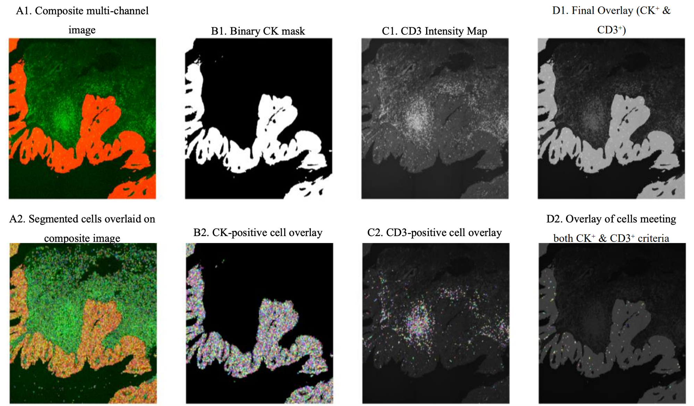

*QC panel for the CK⁺ CD3⁺ subpopulation. Top row: composite, binary CK mask, CD3 intensity map, final CK⁺∩CD3⁺ overlay. Bottom row: same fields with segmented cell overlays.*

### Signed distances to tissue mask

For each cell in a subpopulation, the pipeline computes the signed Euclidean distance to the nearest CK or NGFR boundary:

- **Negative** — centroid is **inside** the mask (intratumoral infiltration)
- **Positive** — centroid is **outside** the mask (stromal exclusion)

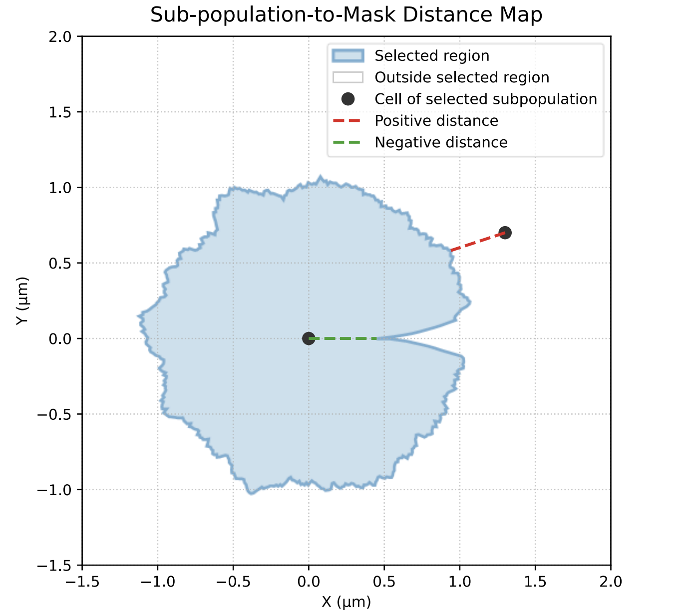

*The blue region is the mask. Green dashed line = infiltrating cell (negative distance); red dashed line = excluded cell (positive distance).*

### Inter-population distances with Voronoi tessellation

Each query cell is assigned to the Voronoi polygon of its nearest reference cell, giving an exact nearest-neighbour distance between the two populations.

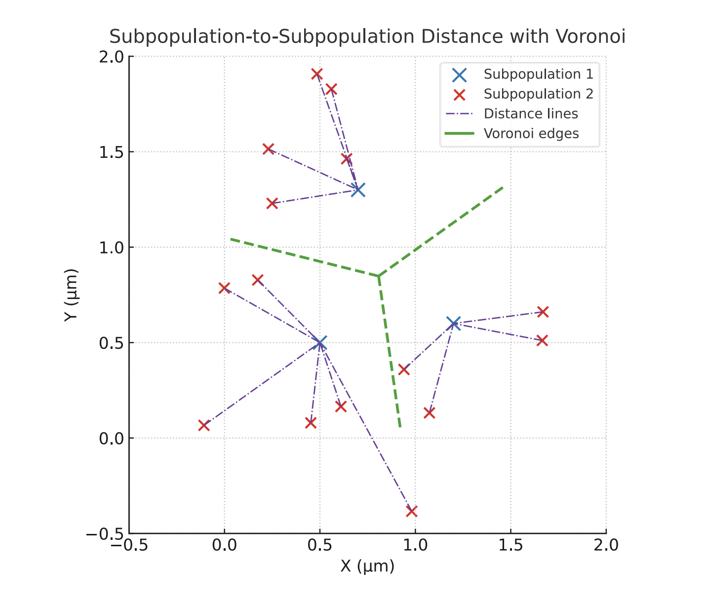

*Blue crosses = reference population, red crosses = query cells, green dashed = Voronoi edges, purple dash-dot = distance vectors.*

---

## Results on HNSCC data

### Tumour characterisation

About 38% of CK⁺ epithelial cells are NGFR⁺. In the NGFR⁺ compartment, Ki-67 proliferation is ~1.5× higher and PD-L1 positivity is enriched, pointing to an immunoregulatory niche.

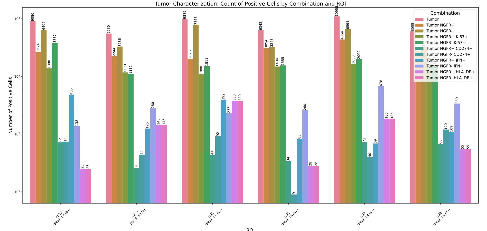

*Cell counts (log scale) per ROI: CK⁺ cells broken down by NGFR±, Ki-67, CD274 (PD-L1), IFN-γ, and HLA-DR positivity across all six ROIs.*

### Cell-level validation

Threshold calls are validated at single-cell resolution. Below, row 2 shows 485 IFN-γ⁺ cells in the CK⁺ NGFR⁺ compartment and row 3 shows 138 in CK⁺ NGFR⁻.

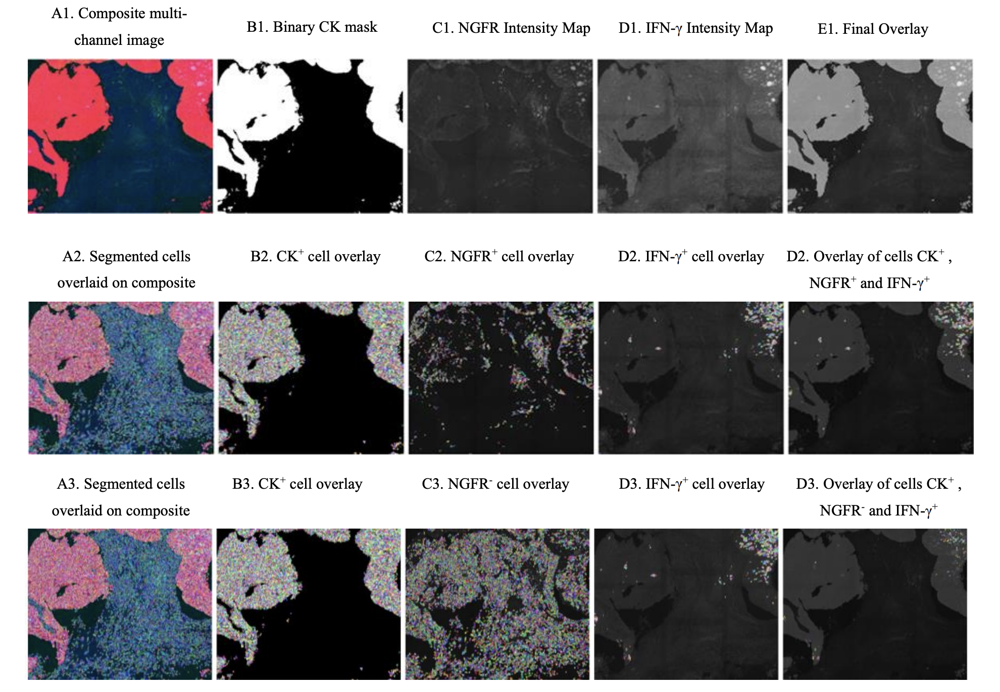

*ROI 11: row 1 = reference channels; rows 2–3 = IFN-γ⁺ overlays for CK⁺ NGFR⁺ and CK⁺ NGFR⁻ compartments.*

### Treg signed-distance overlays

Treg (CD3⁺ CD4⁺ FOXP3⁺) centroids with their signed-distance vectors to the CK boundary. Red = excluded from tumour, green = infiltrating.

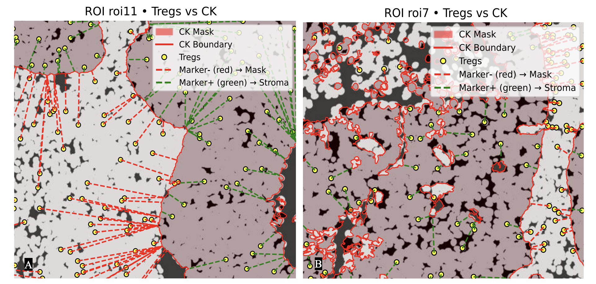

*ROI 11 (A) and ROI 7 (B). Yellow circles = Treg centroids; dashed lines = distance vectors to the CK boundary.*

### Voronoi proximity results

Tessellations over CK⁺ NGFR⁺ and CK⁺ NGFR⁻ centroids show nearly identical Treg proximity distributions — consistent with NGFR being a subset within the broader CK⁺ compartment.

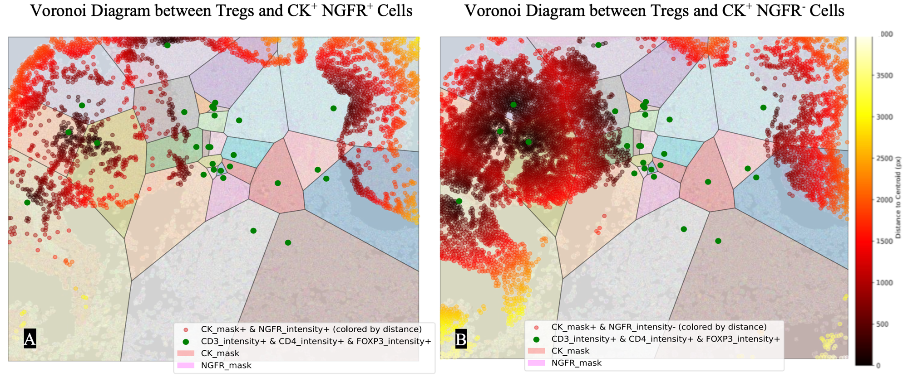

*Tregs (coloured by distance to nearest reference cell) vs CK⁺ NGFR⁺ (A) and CK⁺ NGFR⁻ (B). Dark red = close; orange/yellow = far.*

---

## H&E Invasion-Front Detection

Tumour-invasion fronts — the epithelial margins where active invasion into the stroma occurs — are the most biologically significant region in a biopsy, yet their manual delineation is time-consuming and observer-dependent. This module automates their detection on FFPE H&E whole-slide images.

### Pipeline overview

```
Whole-slide H&E (FFPE, 20×, 0.23 µm px⁻¹)
      │
      ▼
1. Patch extraction       hne/preprocessing/patch_extractor.py   2 048 × 2 048 px tiles
2. Stain decomposition    hne/preprocessing/color_decomposition.py  RGB → hematoxylin + eosin OD
3. Class balancing        hne/preprocessing/balancer.py           oversample invasion-front tiles (×6)
      │
      ▼  Dataset: 2 003 annotated patches, 3 classes
4. U-Net training         hne/training/trainer.py                 Adam + AMP + grad accumulation
5. Inference              hne/inference/predictor.py              batch predict + median filter
6. Metric evaluation      hne/analysis/metrics.py                 IoU, Dice, F1, ROC-AUC
7. Overlay generation     hne/visualization/overlays.py           three-panel RGB/pred/GT figures
```

### Annotation strategy

A two-stage semi-automatic protocol generates dense three-class ground truth with 100% pixel coverage per slide:

1. **Invasion front (class 1):** epithelial margins manually delineated in QuPath 0.6.3 using free-hand polygons, reviewed by an expert pathologist.
2. **Background (class 0):** remaining pixels with mean RGB > 195 (bright glass).
3. **Stroma (class 2):** all remaining non-front pixels.

Post-processing (min object/hole size = 100 µm²) removes debris and fills intraluminal gaps without altering manually traced contours.

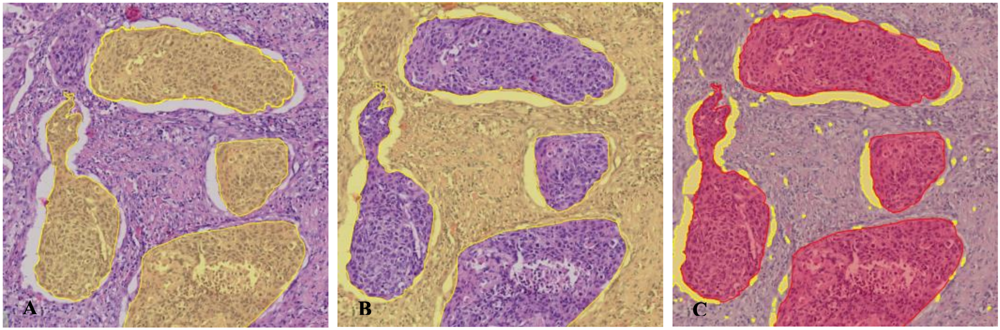

*Semi-automatic annotation workflow on an HNSCC H&E section. **(A)** Original H&E tile with manually traced invasion-front epithelium (yellow/orange overlay) — polygons drawn in QuPath 0.6.3 and validated by a pathologist. **(B)** Inverted non-front mask: stromal tissue (purple) and background glass (bright areas) remain unassigned at this stage. **(C)** Final three-class ground-truth map: red = tumour-invasion front (class 1), yellow = background glass (class 0), gray/purple = stroma (class 2). Every pixel is labelled, giving 100% ground-truth coverage per slide.*

### Stain decomposition

Each RGB tile is decomposed into hematoxylin (nuclear detail) and eosin (cytoplasmic/stromal detail) optical-density channels, giving the model explicit stain signals rather than raw colour values.

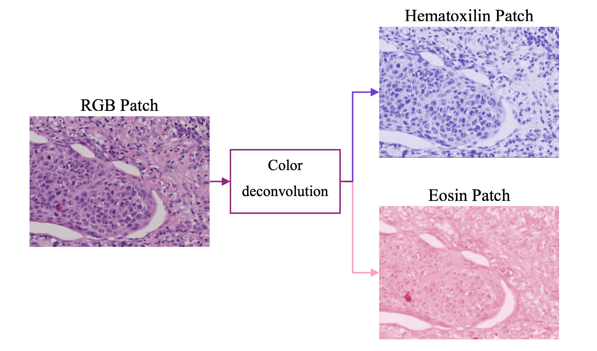

*H&E colour deconvolution (Ruifrok & Johnston, 2001). The RGB tile is separated into two optical-density channels: **hematoxylin** (blue — nuclear staining, dense tumour nests appear darker) and **eosin** (pink — cytoplasmic and stromal proteins). These two channels replace the raw RGB input to the U-Net, providing explicit stain signals that generalise better across scanners and staining batches.*

### Architecture

U-Net with Squeeze-and-Excitation (SE) attention and dilated convolutions (`hne/models/unet.py`):

- **Input:** 2-channel float tensor — normalised H + E optical-density maps.
- **Encoder:** 4 stages; stages 3–4 use dilated convolutions (dilation 2 and 4) to expand the receptive field without extra pooling.
- **Bottleneck:** dilated DoubleConv at dilation 4. Receptive field ≈ 1 325 px (≈ 228 µm).
- **Decoder:** 4 transposed-convolution upsampling stages with skip connections.
- **SE blocks:** every DoubleConv block ends with a channel-attention SE module.
- **Output:** 1×1 convolution to 3 class logits (background / invasion front / stroma).

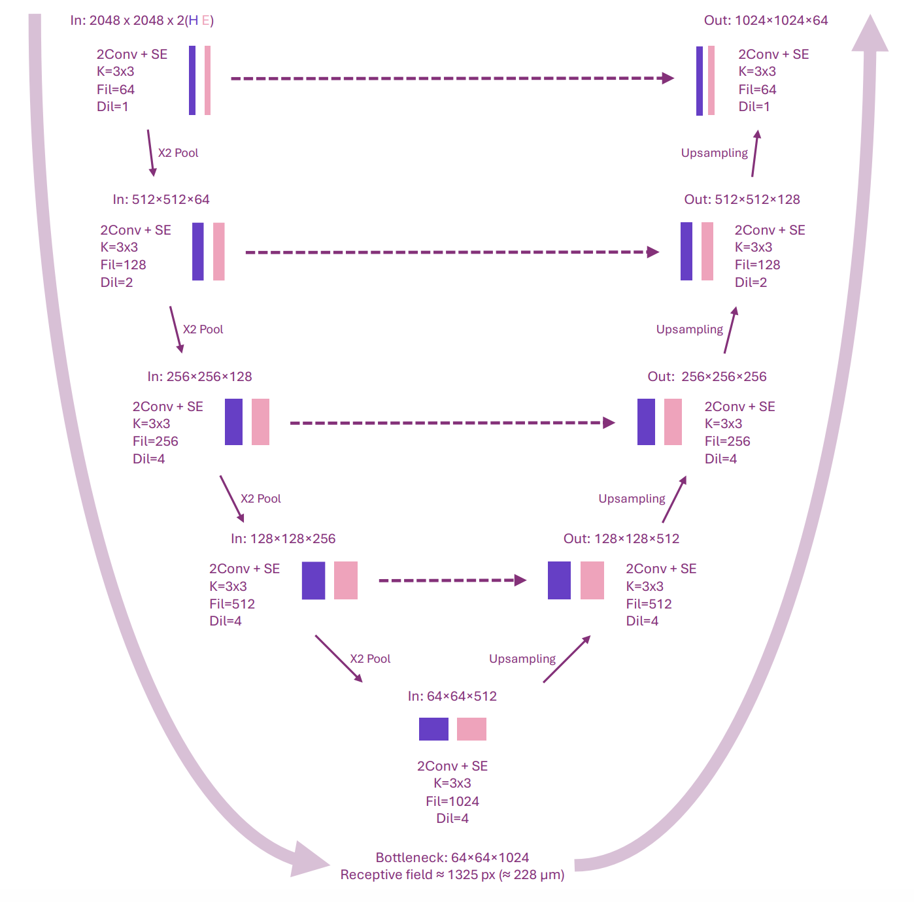

*U-Net with Squeeze-and-Excitation attention and dilated convolutions. Input: 2 048 × 2 048 × 2 (H + E optical-density channels). The encoder progressively doubles the channel count (64 → 128 → 256 → 512) while halving spatial resolution via max-pooling. Stages 3 and 4 use dilated convolutions (dilation 4) instead of standard 3×3 kernels, expanding the receptive field without extra pooling. Bottleneck: 64 × 64 × 1 024, receptive field ≈ 1 325 px (≈ 228 µm at 0.172 µm px⁻¹). Skip connections (dashed arrows) preserve fine-grained spatial detail across the decoder path.*

### Training

| Component | Setting | Rationale |
|---|---|---|
| Patch size | 2 048 × 2 048 px | Balances architectural context with GPU memory |
| Batch size | 1 × 4-step grad accumulation | Effective batch = 4; fits 24 GB VRAM (RTX 4090) |
| Optimiser | Adam β₁=0.9, β₂=0.999 | Proven choice for medical image segmentation |
| Learning rate | 2×10⁻⁴ → 1×10⁻⁶ cosine decay | Smooth annealing over 50 epochs |
| Loss | Cross-entropy + 0.3 × Dice | Pixel accuracy plus Dice to mitigate class imbalance |
| Mixed precision | AMP float16 | Doubles throughput, halves VRAM |
| Regularisation | Weight decay 1×10⁻⁵; dropout 0.1 | Controls overfitting on oversampled tumor tiles |
| Augmentation | Flips, 0–270° rot, ±10% intensity jitter, Gaussian noise σ=0.02 | Staining, orientation and scanner variability |
| Early stopping | Patience = 8 epochs on val Dice | Halts once convergence is reached |

```bash
uv sync --group ml   # adds torch, torchvision, scikit-learn
```

### Results on HNSCC H&E data

Trained and evaluated on **2 003 semi-automatically annotated patches** (2 048 × 2 048 px) from HNSCC biopsies scanned at 20× (0.23 µm px⁻¹).

| Metric | Background | Invasion Front | Stroma | Overall |
|--------|-----------|----------------|--------|---------|
| IoU | 0.79 | 0.61 | 0.68 | — |
| Dice | 0.88 | 0.76 | 0.81 | — |
| Precision | 0.82 | 0.69 | 0.90 | 0.80 |
| Recall | 0.95 | 0.85 | 0.73 | 0.84 |
| F1 | 0.88 | 0.76 | 0.81 | **0.82** |
| AUC | 0.96 | 0.93 | 0.91 | — |

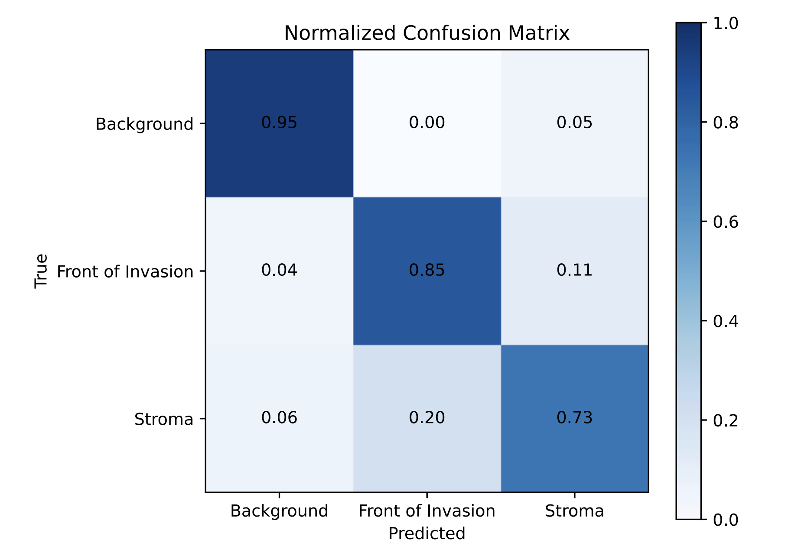

*Normalised confusion matrix (recall per row). Background is nearly perfectly separated (recall 0.95) — bright glass has a characteristic photometric signature that the model identifies reliably. The hardest distinction is between invasion front and stroma: 11% of true invasion-front pixels are misclassified as stroma, and 20% of stroma pixels are misclassified as invasion front, reflecting the gradual morphological transition at the tumour–stroma interface.*

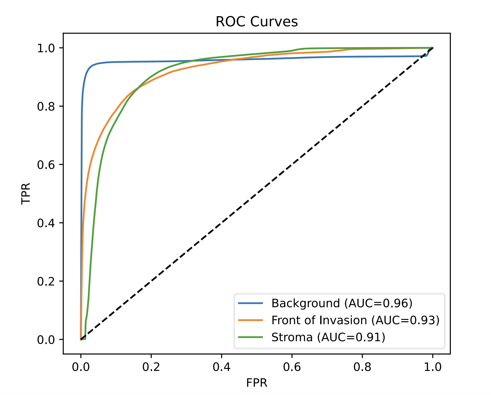

*ROC curves per class. All three curves lie well above the diagonal, confirming strong discriminative power across all tissue types. AUC: **background 0.96** · **invasion front 0.93** · **stroma 0.91**. Background achieves the highest separation owing to its uniform bright intensity; invasion front and stroma share similar nuclear density patterns, which accounts for the slightly lower AUC on those classes.*

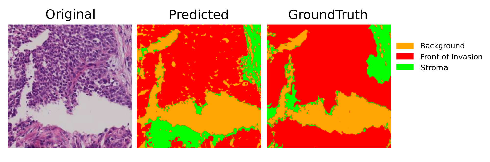

*Representative test patch (2 048 × 2 048 px, HNSCC biopsy). **Left:** original H&E tile. **Centre:** model prediction after morphological post-processing. **Right:** expert ground truth. Colour key: orange = background glass, red = tumour invasion front, green = stroma. The model correctly delineates the invasion front along the epithelial margin and cleanly excludes the background; minor discrepancies appear at stromal boundaries where the transition is morphologically ambiguous.*

### H&E module quick-start

```python
from multiplex_pipeline.hne.models.unet import UNet
from multiplex_pipeline.hne.data.dataset import PatchDataset, get_valid_pairs
from multiplex_pipeline.hne.training.trainer import train_model
from multiplex_pipeline.hne.inference.predictor import predict_patches
from multiplex_pipeline.hne.analysis.metrics import compute_iou_dice, compute_roc_auc

# ── Data ─────────────────────────────────────────────────────────────────────
pairs = get_valid_pairs("data/patches")
split = int(0.8 * len(pairs))
train_ds = PatchDataset(pairs[:split], augment=True)
val_ds   = PatchDataset(pairs[split:], augment=False)

# ── Train ─────────────────────────────────────────────────────────────────────
model = UNet()
history = train_model(model, train_ds, val_ds, device="cuda", epochs=10)

# ── Evaluate ──────────────────────────────────────────────────────────────────
y_true, y_pred, y_prob = predict_patches(model, val_ds, device="cuda")
scores = compute_iou_dice(y_true, y_pred)
auc    = compute_roc_auc(y_true, y_prob)
```

---

## Repository structure

```
MultiplexAnalysisProgram/
├── config.py                     # IF pipeline parameters (paths, markers,
│                                 # channels, thresholds, subpopulation rules)
├── schema.py                     # IF DataFrame column-name constants
│
├── analysis/
│   ├── intensity.py              # Intensity extraction + adaptive thresholding
│   └── spatial.py                # Mask-area summaries + distance calculations
│
├── io/
│   └── loaders.py                # OME-TIFF / DAPI / CSV loaders
│
├── preprocessing/
│   └── segmentation.py           # Binary mask creation + morphological refinement
│
├── utils/
│   ├── helpers.py                # ROI-number extraction, dict utilities
│   └── validation.py             # Binary mask validation
│
├── visualization/
│   ├── data_prep.py              # Pure data-transformation helpers
│   ├── plotting.py               # Pure matplotlib functions
│   ├── overlays.py               # Orchestration: overlay plots + distance plots
│   └── qc.py                     # Bar plots, violin/box plots, mask QC
│
├── hne/                          # H&E invasion-front detection (deep learning)
│   ├── config.py                 # All H&E hyperparameters and paths
│   ├── schema.py                 # H&E DataFrame column-name constants
│   ├── models/
│   │   └── unet.py               # U-Net + SE attention + dilated convolutions
│   ├── training/
│   │   └── trainer.py            # Training loop (AMP, gradient accumulation)
│   ├── inference/
│   │   └── predictor.py          # Batch inference + morphological post-processing
│   ├── analysis/
│   │   └── metrics.py            # IoU, Dice, F1, ROC-AUC, confusion matrix
│   ├── preprocessing/
│   │   ├── patch_extractor.py    # Whole-slide → 2048×2048 PNG tiles
│   │   ├── color_decomposition.py# RGB → hematoxylin + eosin OD channels
│   │   ├── augmentation.py       # Geometric augmentations (rot, flip)
│   │   └── balancer.py           # Oversample invasion-front patches
│   ├── data/
│   │   └── dataset.py            # PatchDataset: loads quad (RGB/H/E/mask)
│   ├── io/
│   │   └── loaders.py            # Patch/mask file discovery helpers
│   └── visualization/
│       ├── eda.py                # Exploratory data analysis plots
│       └── overlays.py           # Three-panel overlay (original/pred/GT)
│
├── tests/
│   ├── test_overlays_refactor.py # 16 IF smoke tests
│   ├── test_hne_models.py        # U-Net / SE / DoubleConv unit tests
│   ├── test_hne_preprocessing.py # Stain decomposition + augmentation tests
│   └── test_hne_metrics.py       # IoU, Dice, F1, AUC unit tests
│
├── notebooks/
│   ├── IF_analysis.ipynb                        # Main multiplex IF pipeline
│   ├── data_preparation_tumor_invasion_front.ipynb  # H&E patch preparation
│   └── tumor_invasion_front_detection.ipynb     # H&E model training + eval
│
├── docs/images/                  # Pipeline figures (tracked)
├── pyproject.toml
├── .pre-commit-config.yaml
└── conftest.py
```

---

## Installation

Requires **Python ≥ 3.10**.

### With uv (recommended)

```bash
git clone https://github.com/anchu09/MultiplexAnalysisProgram.git
cd MultiplexAnalysisProgram
uv sync                    # IF pipeline (numpy, pandas, scipy, scikit-image…)
uv sync --group ml         # + H&E module (torch, torchvision, scikit-learn)
```

### With pip

```bash
pip install -e .
# For the H&E deep-learning module:
pip install torch torchvision scikit-learn
```

### Development setup

```bash
uv sync --group ml
pre-commit install
```

---

## Configuration

All parameters live in `config.py`. Column names shared across DataFrames are in `schema.py`.

### Data paths (IF pipeline)

Data paths are controlled by environment variables so the pipeline is portable across machines:

| Variable | Default | Purpose |
|---|---|---|
| `MULTIPLEX_DATA_DIR` | `data/` | Directory containing OME-TIFF image files |
| `MULTIPLEX_DAPI_DIR` | `data/export_DAPI/` | Exported DAPI masks from QuPath |
| `MULTIPLEX_MASKS_DIR` | `data/exportedmasks/` | Exported CK/NGFR masks |
| `MULTIPLEX_RESULTS_DIR` | `results_spatial_analysis/` | Output root for all analysis results |

```bash
export MULTIPLEX_DATA_DIR=/path/to/your/images
export MULTIPLEX_DAPI_DIR=/path/to/dapi_masks
export MULTIPLEX_MASKS_DIR=/path/to/exported_masks
```

### Other parameters

| Section | What to edit |
|---------|-------------|
| `MARKER_LABELS` | Channel-index → biomarker name mapping (22 channels) |
| `CK_SETTINGS`, `NGFR_SETTINGS` | Mask generation: threshold k, morphological ops |
| `INTENSITY_THRESHOLDS` | Per-marker k values for T = μ + k · σ |
| `CHARACTERIZATION_COMBINATIONS` | Tumour characterisation subpopulations |
| `INFILTRATION_COMBINATIONS` | Immune infiltration subpopulations |
| `SUBPOPULATIONS` | Phenotype definitions for distance analysis |

---

## Usage

All steps are designed to be run from Jupyter notebooks (see `notebooks/IF_analysis.ipynb`).

### Load images and masks

```python
from multiplex_pipeline.io.loaders import load_ome_tif_images, load_dapi_masks
from multiplex_pipeline.config import DATA_FOLDER, EXPORT_DAPI_FOLDER

images = load_ome_tif_images(DATA_FOLDER)          # {filename: (C, H, W) array}
dapi_masks = load_dapi_masks(EXPORT_DAPI_FOLDER)   # {'roi1_dapi': (H, W) array}
```

### Generate CK and NGFR tissue masks

```python
from multiplex_pipeline.preprocessing.segmentation import create_channel_masks
from multiplex_pipeline.config import CK_SETTINGS, NGFR_SETTINGS

ck_masks   = create_channel_masks(images, dapi_masks, **CK_SETTINGS)
ngfr_masks = create_channel_masks(images, dapi_masks, **NGFR_SETTINGS)
```

### Extract per-cell intensities and apply thresholds

```python
from multiplex_pipeline.analysis.intensity import process_roi, intensity_to_binary
from multiplex_pipeline.config import CHANNELS_OF_INTEREST, MARKER_LABELS, INTENSITY_THRESHOLDS
import pandas as pd

frames = [
    process_roi(name, img, dapi_masks, ck_masks, ngfr_masks,
                CHANNELS_OF_INTEREST, MARKER_LABELS)
    for name, img in images.items()
]
intensity_df = pd.concat([r for r in frames if r is not None], ignore_index=True)
binary_df    = intensity_to_binary(intensity_df, INTENSITY_THRESHOLDS)
```

### Count cell subpopulations

```python
from multiplex_pipeline.visualization.qc import plot_combination_counts
from multiplex_pipeline.config import CHARACTERIZATION_COMBINATIONS

rois = binary_df["ROI"].unique().tolist()
counts = plot_combination_counts(
    binary_df, rois, CHARACTERIZATION_COMBINATIONS,
    output_dir="results/cell_counting",
    base_filename="tumor_characterization",
    plot_title="Tumour Characterisation — CK⁺ Subpopulations",
)
```

### Compute inter-population distances (Voronoi)

```python
from multiplex_pipeline.visualization.overlays import compute_and_plot_subpop_distances_for_all_rois
from multiplex_pipeline.config import (
    SUBPOPULATION_A_POSITIVE, SUBPOPULATIONS, CONDITION_COLUMN_MAP,
    SHADING_COLORS, PIXEL_SIZE,
)

shading_dict = {
    "CK_mask":   (ck_masks,   SHADING_COLORS["CK_mask"]),
    "NGFR_mask": (ngfr_masks, SHADING_COLORS["NGFR_mask"]),
}

distances = compute_and_plot_subpop_distances_for_all_rois(
    rois=rois,
    subpop_conditions_A=SUBPOPULATION_A_POSITIVE,
    subpop_conditions_B=SUBPOPULATIONS["Tregs"],
    df_binary=binary_df,
    dapi_masks_dict=dapi_masks,
    condition_column_map=CONDITION_COLUMN_MAP,
    pixel_size=PIXEL_SIZE,
    masks_to_shade=["CK_mask", "NGFR_mask"],
    shading_dict=shading_dict,
    save_matrix_as_csv=True,
    plot_type="voronoi",
)
```

---

## Tests

```bash
pytest tests/ -v            # full suite (IF + H&E; requires ml group for metrics tests)
pytest tests/test_hne_models.py tests/test_hne_preprocessing.py -v   # H&E (no ML deps)
ruff check .                # linting
ruff format --check .       # formatting
pre-commit run --all-files  # full suite
```

---

## License

MIT
